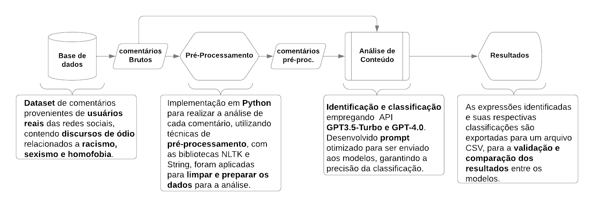

# Analysis Dataset: BOU-Guard - A Study in Real-World Scenarios

Este repositório contém a análise e o estudo do BOU-Guard, uma ferramenta para detectar discursos ofensivos (racismo, homofobia, sexismo) em cenários reais utilizando comentários de redes sociais como Twitter (X), Reddit e YouTube.

## 📋 Objetivo

Investigar a viabilidade e o comportamento de Modelos de Linguagem de Grande Escala (LLMs) na detecção de discursos ofensivos em redes sociais, comparando o desempenho das versões GPT-3.5 e GPT-4.
Este estudo é para promover a ferramenta  [`BOU-Guard | Extension`](https://github.com/guilhermebou/BOU-Guard-Extension), realizando uma comparação de modelos em um estudo de viabilidade.

## 🛠 Estrutura do Repositório

- `data/`  
  Contém os datasets analisados no estudo.  
- `python/`  
  Contém os scripts de análise, pré-processamento de dados e classificação.  
- `results/`  
  Resultados finais organizados em planilhas.  
- `docs/`  
  documentação para fundamentação.

## 🚀 Funcionalidades

- **Pré-processamento de Dados**: Filtragem e organização de grandes volumes de dados de redes sociais.
- **Classificação Automatizada**: Uso de APIs para identificar conteúdos ofensivos em tempo real.
- **Visualização de Dados**: Apresentação dos resultados em relatórios organizados.

## 🧪 Metodologia

1. **Coleta de Dados**: Extração de comentários de redes sociais.
2. **Pre-processamento**: Aplicação de técnicas de análise de dados e pré-processamento.
3. **Análise**: Classificação utilizando LLMs (GPT-3.5 e GPT-4).
4. **Comparação de Resultados**: Medição de desempenho, utilizando metricas como Recall, Precision e F1-SCORE.

## 📊 Resultados

Os resultados mostraram uma alta taxa de precisão do GPT-4 em relação ao GPT-3.5, com melhorias na identificação de nuances linguísticas em comentários ofensivos.
### Análise Conteúdo Bruto GPT-3.5-Turbo

| **Temática**  | **Precision** | **Recall** | **F1-Score** | **Comentários** |
|---------------|---------------|------------|--------------|-----------------|
| **Homofobia** | 100%          | 73,09%     | 84,45%       | 680             |
| **Racismo**   | 100%          | 50,15%     | 66,80%       | 680             |
| **Sexismo**   | 100%          | 40,15%     | 57,29%       | 680             |
| **Neutro**    | 100%          | 92,79%     | 96,26%       | 680             |

### Análise Pré-Processada GPT-3.5-Turbo

| **Temática**  | **Precision** | **Recall** | **F1-Score** | **Comentários** |
|---------------|---------------|------------|--------------|-----------------|
| **Homofobia** | 100%          | 73,97%     | 85,04%       | 680             |
| **Racismo**   | 100%          | 56,91%     | 72,54%       | 680             |
| **Sexismo**   | 100%          | 30,59%     | 46,85%       | 680             |
| **Neutro**    | 100%          | 89,56%     | 94,49%       | 680             |

### Análise Pré-Processada GPT-4.0

| **Temática**  | **Precision** | **Recall** | **F1-Score** | **Comentários** |
|---------------|---------------|------------|--------------|-----------------|
| **Homofobia** | 100%          | 95,59%     | 97,74%       | 680             |
| **Racismo**   | 100%          | 57,35%     | 72,90%       | 680             |
| **Sexismo**   | 100%          | 69,12%     | 81,74%       | 680             |
| **Neutro**    | 100%          | 91,47%     | 95,55%       | 680             |

Analisando os resultados mais minuciosamente, foram encontrados alguns ruídos nos datasets de sexismo e racismo. Neles, não estavam presentes 100% dos comentários correspondentes às suas respectivas labels. Por isso, foi realizada uma segunda análise manual, apresentada no arquivo[`manual_analysis_comments_racist_sexist.xlsx`](https://github.com/guilhermebou/Analysis-Dataset-BOU-Guard-A-Study-in-Real-World-Scenarios/blob/main/Data/Results/manual_analysis_comments_racist_sexist.xlsx)

### *Datasets* Validados Manualmente - Análise GPT-3.5-Turbo

| **Temática**  | **Precision** | **Recall** | **F1-Score** | **Comentários** |
|---------------|---------------|------------|--------------|-----------------|
| **Racismo**   | 100%          | 76,66%     | 86,79%       | 450             |
| **Sexismo**   | 100%          | 40,35%     | 57,50%       | 456             |

### *Datasets* Validados Manualmente - Análise GPT-4.0

| **Temática**  | **Precision** | **Recall** | **F1-Score** | **Comentários** |
|---------------|---------------|------------|--------------|-----------------|
| **Racismo**   | 100%          | 84,59%     | 91,65%       | 450             |
| **Sexismo**   | 100%          | 91,67%     | 95,65%       | 456             |
