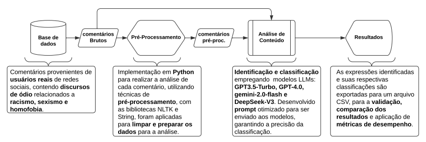

# Analysis Dataset: BOU-Guard - A Study in Real-World Scenarios

Este repositório contém a análise e o estudo do BOU-Guard, uma ferramenta para detectar discursos ofensivos (racismo, homofobia, sexismo) em cenários reais utilizando comentários de redes sociais como Twitter (X), Reddit e YouTube.

## 📋 Objetivo

Investigar a viabilidade e o comportamento de Modelos de Linguagem de Grande Escala (LLMs) na detecção de discursos ofensivos em redes sociais, comparando o desempenho das versões GPT-3.5, GPT-4, Gemini-2.0-Flash e DeepSeek-V3.
Este estudo é para promover a ferramenta  [`BOU-Guard | Extension`](https://github.com/guilhermebou/BOU-Guard-Extension), realizando uma comparação de modelos em um estudo de viabilidade.

## 🛠 Estrutura do Repositório

- `data/`  
  Contém os datasets analisados no estudo.  
- `python/`  
  Contém os scripts de análise, pré-processamento de dados e classificação.  
- `results/`  
  Resultados finais organizados em planilhas.  
- `docs/`  
  documentação para fundamentação.

## 🚀 Funcionalidades

- **Pré-processamento de Dados**: Filtragem e organização de grandes volumes de dados de redes sociais.
- **Classificação Automatizada**: Uso de APIs para identificar conteúdos ofensivos em tempo real.
- **Visualização de Dados**: Apresentação dos resultados em relatórios organizados.

## 🧪 Metodologia

1. **Coleta de Dados**: Extração de comentários de redes sociais.
2. **Pre-processamento**: Aplicação de técnicas de análise de dados e pré-processamento.
3. **Análise**: Classificação utilizando LLMs (GPT-3.5, GPT-4, gemini-2.0-Flash e DeepSeek-V3).
4. **Comparação de Resultados**: Medição de desempenho, utilizando metricas como Recall, Precision e F1-SCORE.

## 📊 Resultados

# Comparativo de desempenho dos modelos de LLMs para detecção de discursos de ódio

| Modelo           | Tipo de Conteúdo | Categoria  | Qtd Comentários | Precision (%) | Recall (%) | F1-score (%) |
|------------------|------------------|------------|-----------------|---------------|------------|--------------|
| DeepSeek-V3      | Bruto            | Homofobia  | 680             | 100,00        | 99,26      | 99,63        |
| DeepSeek-V3      | Bruto            | Sexismo    | 456             | 100,00        | 96,71      | 98,33        |
| DeepSeek-V3      | Bruto            | Racismo    | 450             | 100,00        | 88,22      | 93,74        |
| DeepSeek-V3      | Bruto            | Normal     | 680             | 100,00        | 83,82      | 91,20        |
| DeepSeek-V3      | Pré-processado   | Homofobia  | 680             | 100,00        | 98,97      | 99,48        |
| DeepSeek-V3      | Pré-processado   | Sexismo    | 456             | 100,00        | 85,53      | 92,20        |
| DeepSeek-V3      | Pré-processado   | Racismo    | 450             | 100,00        | 70,67      | 82,81        |
| DeepSeek-V3      | Pré-processado   | Normal     | 680             | 100,00        | 81,18      | 89,61        |
| Gemini-2.0-Flash | Bruto            | Homofobia  | 680             | 100,00        | 88,53      | 93,92        |
| Gemini-2.0-Flash | Bruto            | Sexismo    | 456             | 100,00        | 86,40      | 92,71        |
| Gemini-2.0-Flash | Bruto            | Racismo    | 450             | 100,00        | 54,44      | 70,50        |
| Gemini-2.0-Flash | Bruto            | Normal     | 680             | 100,00        | 90,88      | 95,22        |
| Gemini-2.0-Flash | Pré-processado   | Homofobia  | 680             | 100,00        | 90,59      | 95,06        |
| Gemini-2.0-Flash | Pré-processado   | Sexismo    | 456             | 100,00        | 89,04      | 94,20        |
| Gemini-2.0-Flash | Pré-processado   | Racismo    | 450             | 100,00        | 30,00      | 46,15        |
| Gemini-2.0-Flash | Pré-processado   | Normal     | 680             | 100,00        | 91,03      | 95,30        |
| GPT-4.0          | Bruto            | Homofobia  | 680             | 100,00        | 96,03      | 97,97        |
| GPT-4.0          | Bruto            | Sexismo    | 456             | 100,00        | 92,76      | 96,25        |
| GPT-4.0          | Bruto            | Racismo    | 450             | 100,00        | 73,11      | 84,47        |
| GPT-4.0          | Bruto            | Normal     | 680             | 100,00        | 92,21      | 95,94        |
| GPT-4.0          | Pré-processado   | Homofobia  | 680             | 100,00        | 95,59      | 97,74        |
| GPT-4.0          | Pré-processado   | Sexismo    | 456             | 100,00        | 91,67      | 95,65        |
| GPT-4.0          | Pré-processado   | Racismo    | 450             | 100,00        | 81,78      | 89,98        |
| GPT-4.0          | Pré-processado   | Normal     | 680             | 100,00        | 91,47      | 95,55        |
| GPT-3.5-Turbo    | Bruto            | Homofobia  | 680             | 100,00        | 73,09      | 84,45        |
| GPT-3.5-Turbo    | Bruto            | Sexismo    | 456             | 100,00        | 54,82      | 70,82        |
| GPT-3.5-Turbo    | Bruto            | Racismo    | 450             | 100,00        | 72,82      | 84,27        |
| GPT-3.5-Turbo    | Bruto            | Normal     | 680             | 100,00        | 92,79      | 96,26        |
| GPT-3.5-Turbo    | Pré-processado   | Homofobia  | 680             | 100,00        | 73,97      | 85,04        |
| GPT-3.5-Turbo    | Pré-processado   | Sexismo    | 456             | 100,00        | 40,35      | 57,50        |
| GPT-3.5-Turbo    | Pré-processado   | Racismo    | 450             | 100,00        | 76,66      | 86,79        |
| GPT-3.5-Turbo    | Pré-processado   | Normal     | 680             | 100,00        | 89,56      | 94,49        |

# Média geral de F1-Score por modelo LLM

| Modelo           | F1-Score (Bruto) | F1-Score (Pré) | Média Geral |
|------------------|------------------|----------------|-------------|
| GPT-4.0          | 93,65%           | 94,73%         | 94,19%      |
| DeepSeek-V3      | 95,73%           | 91,02%         | 93,37%      |
| Gemini-2.0-Flash | 88,08%           | 82,67%         | 85,26%      |
| GPT-3.5-Turbo    | 83,95%           | 80,95%         | 82,45%      |

# Resumo comparativo entre modelos LLMs quanto a desempenho e custo (valores aproximados)

| Indicador                    | DeepSeek-V3 | GPT-4.0  | GPT-3.5 Turbo | Gemini 2.0 Flash |
|------------------------------|-------------|----------|---------------|------------------|
| Quantidade de Requisições    | 8.449       | 11.688   | 17.954        | 4.117            |
| Tokens Processados (total)   | 1.081.571   | 1.309.650| 2.065.000     | 540.356          |
| Média de Tokens (por 680 req.) | 87.048    | 76.195   | 78.211        | 89.250           |
| Tempo Médio por 680 req. (min)| 13,06      | 12,31    | 16,25         | 13,19            |
| Custo por 680 req. (US$)     | 0,05        | 1,57     | 0,25          | 0,06             |
| Custo Total (US$)            | 0,66        | 26,99    | 3,32          | 0,12             |

